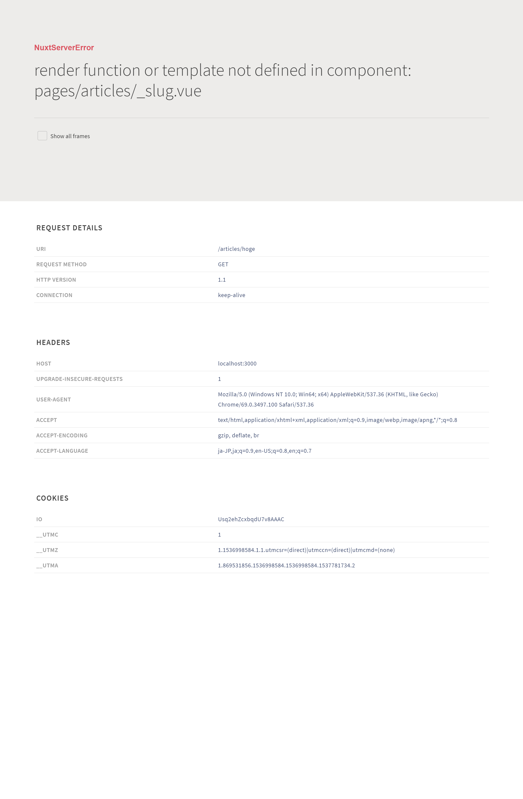

# 要件

+ Nuxt.jsの静的ページ出力機能を利用する
+ さくらインターネットのレンタルサーバー(スタンダードプラン)を利用する
+ 基本的に Visual Studio Code で作る

また、この記事はNode.jsをインストールしている前提で話を進めていきます。

# Nuxt.jsを始める

Nuxt.jsはVue.jsとWebpackとBabelで動きます。サーバーサイドレンダリングなどを売りとしていますが、レンタルサーバーで公開するため `nuxt generate` で生成できる静的なページをつくることもできます。

[Nuxt.jsのガイド](https://nuxtjs.org/guide/installation) では `npx` で `create-nuxt-app` を利用する方法が紹介されています。日本語版ではこの方法が紹介されていませんが、これはつい先日 Nuxt v2 がリリースされたばかりで、まだ新しいものだからだと思われます。

では始めます。初めに空のGitHubリポジトリを作成し、あるフォルダにクローンしておきます。このフォルダでNuxt.jsのホームページ開発を進めていきます。今回はリポジトリ名、フォルダ名ともにドメイン名から "yasuda-computer-club" としました。

まずそのフォルダをVSCodeで開き、以下のコマンドを実行していきます。

1. `cd ../`
1. `npx create-nuxt-app yasuda-computer-club`
1. `cd yasuda-computer-club`
1. `npm run dev`

たったこれだけでローカルサーバーが立ち上がり、http://localhost:3000 にアクセスすると以下のような画面が表示されます。


まず 1 のコマンドでは1つ上のディレクトリに移動しています。次にキモとなる 2 のコマンドでは npm5.2.0 から使える `npx` を利用し、インストールしていない `create-nuxt-app` というパッケージを一時的にダウンロードし、実行しています。`create-nuxt-app` には `yasuda-computer-club` を渡していますが、これはNuxt.jsで開発するフォルダ名です。このコマンドを実行すると以下のような質問がされますので、カッコ内に出されているもので問題なければそのままEnterキーを、変更する必要があれば入力してEnterキーを押します。

| 質問 | 説明 | 今回入力した値 |
|:---|:---|:---|
| Project name | プロジェクト名(文字列) | yasuda-computer-club |
| Project description | 説明(文字列) | A website of Yasuda Gakuen Computer Cub |
| Use a custom server framework | どのサーバーフレームワークを使うか(選択) | none |
| Use a custom UI framework | どのUIフレームワークを使うか(選択) | none |
| Choose rendering mode | SPAかどうか(選択) | Universal |
| Use axios moudle | axiosを使うか(Y/N) | no |
| Use eslint | ESLintを使うか(Y/N) | no |
| Use prettier | Prettierを使うか(Y/N) | no |
| Author name | 制作者名 | Yasuda-Computer-Club |
| Choose a package manager | npmかyarnか(選択) | npm |

以上が `create-nuxt-app` の質問です。Project name と Project description と Author name はpackage.jsonに書かれるようです。Use a custom server framework はレンタルサーバーなのでなし、Use a custom UI framework に関しては、今回トレーニングの意味も込めてすべて自作するのでなし、Choose rendering mode は `nuxt generate` を使うのでUniversal、axiosは今のところ使う予定がないのでno、ESLint, Prettierはよくわからなかったのでnoにしました。

これらを入力してログが流れるのを眺めた後、To get started などが出てきたら完了です。To get startedに従ってコマンドを打てばローカルサーバーが立ち上がり、先ほどのページが表示されます。

ここまでの作業を行うと、以下のようなディレクトリ構造ができあがっています。

```
yasuda-computer-club/
    ├ .nuxt/
    ├ assets/
    ├ components/
    ├ layouts/
    ├ middleware/
    ├ node_modules/
    ├ pages/
    ├ plugins/
    ├ static/
    ├ store/
    ├ .editorconfig
    ├ .gitignore
    ├ nuxt.config.js
    ├ package-lock.json
    ├ package.json
    └ README.md
```

ホームページをビルに例えるなら、ここまでで建物が建ったことになります。`create-nuxt-app` を利用するとあっという間に建物を建てることができてとても便利です。ここから設備や装飾などをして内装を整えます。

# PWA化する

PWAは Progressive Web Apps のことです。詳しい説明は省略しますが、Nuxt.jsではとても簡単にPWAを実装することができます。

まずは `npm install @nuxtjs/pwa --save` を実行して `@nuxtjs/pwa` をインストールします。次に nuxt.config.js の modules の配列に "@nuxtjs/pwa" を追加します。

これだけでPWA化は完了です。

# 内容を作る

このホームページ最初の内容はこのホームページを作成する記事をしますので、まずは記事データを入れるフォルダを作成します。yasuda-compter-club 直下に articlesディレクトリを作成します。この記事は create-website_1 としますので、以下のようにファイル・フォルダを作成します。

```
yasuda-computer-club/
    │(省略)
    ├ contents/
    │     └ articles/
    │         └ create-website_1/
    │             └ main.md
    │(省略)
```

同名のファイルとフォルダが存在するのは、markdownの本文ファイルと、そこに入れる画像ファイルを入れるフォルダということです。この記事は create-website_1.md で本文が書かれていて、create-website_1/ の中に画像が入っています。

それでは記事ページを作成します。Nuxtには `vue-router` が組み込まれていて、pages/ の中の *.vue ファイルをページを認識します。現在は index.vue と README.md が入っているだけとなっています。README.md はホームページには直接関係しないので、今は放置でよいでしょう。この中に記事ページを作成するので、以下のようなディレクトリ構造にします。

```
pages/
    ├ articles/
    │     └ _slug.vue
    ├ index.vue
    └ README.md
```

pagesディレクトリの中に *.vue ファイルを入れるとそれをページと認識しますが、"_" から始まるファイルは、`vue-router` でいう動的なルーティングとなります。つまり、今は http://localhost:3000/articles/hoge などのようなページにアクセスできます。しかし、_slug.vue の中にまだ何も書いていないので以下のようなエラーページが表示されます。



Nuxt.js はエラーページの見た目までえらく凝っていますね。

このままではいけないので内容を表示させますが、この記事はmarkdownで書かれているので、markdownを読み込めるようにしなければなりません。そこで [`@nuxtjs/markdownit`](https://www.npmjs.com/package/@nuxtjs/markdownit) を使います。

`npm install @nuxtjs/markdownit --save` を実行して、nuxt.config.js の modules の配列に　`"@nuxtjs/markdownit"` を追記します。